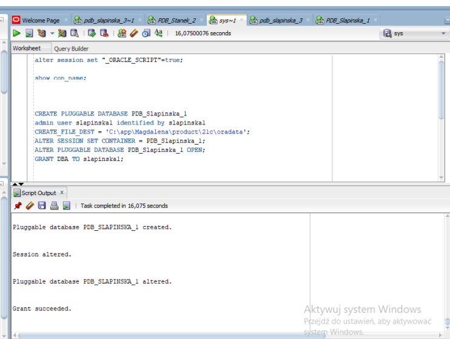
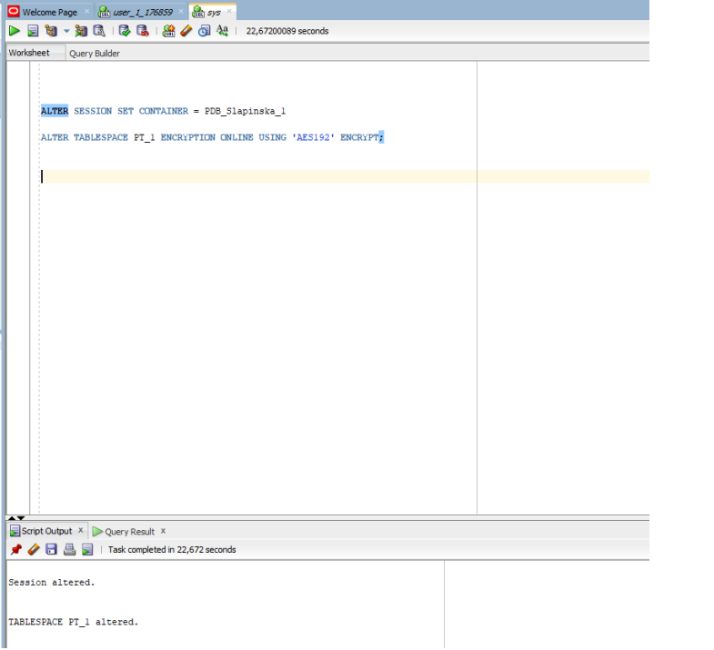
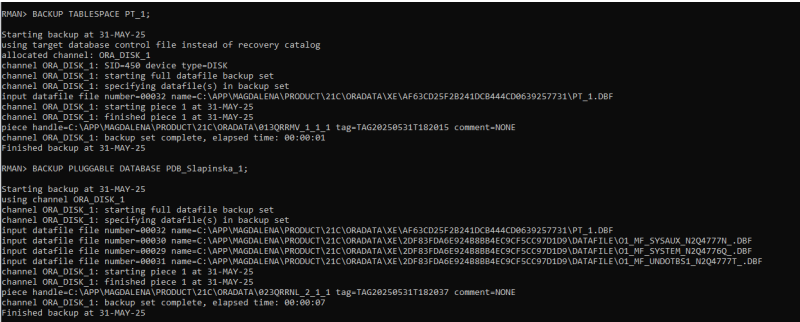
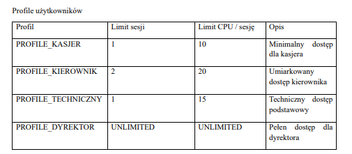
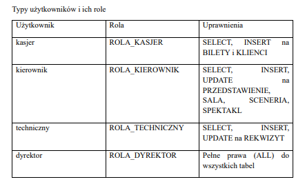

# Oracle 21c Database Administration & Multitenant Architecture

## Opis projektu
Projekt inżynierski dedykowany zaawansowanej administracji, konfiguracji oraz utwardzaniu (hardeningowi) systemów bazodanowych w środowisku **Oracle Database 21c Express Edition**. Głównym celem było zaprojektowanie i wdrożenie bezpiecznej struktury wielodostępnej (Multitenant Architecture) składającej się z bazy kontenerowej (CDB) oraz niezależnych, wtykalnych baz danych (PDB) dedykowanych obsłudze wielojęzycznych modułów systemu zarządzania teatrem.

Projekt obejmuje pełen cykl administracyjny: od wirtualizacji środowiska, przez konfigurację sieciową i optymalizację parametrów NLS, aż po implementację procedur bezpieczeństwa (Transparent Data Encryption), kontrolę transakcyjną (RBAC) oraz strategię odzyskiwania danych po awarii (Disaster Recovery).

Projekt zrealizowany w ramach przedmiotu *Administracja systemów bazodanowych* na Politechnice Rzeszowskiej (Kierunek: Inżynieria i Analiza Danych).

## Technologie i narzędzia
* **Silnik bazy danych:** Oracle Database 21c Express Edition (CDB / PDB Architecture)
* **Narzędzia administracyjne:** Oracle SQL Developer, Recovery Manager (RMAN), SQL*Plus
* **Wirtualizacja & OS:** Oracle VMware Workstation Pro, Windows 10 Enterprise
* **Bezpieczeństwo (SecOps):** Transparent Data Encryption (TDE), Oracle Wallet, RBAC (Role-Based Access Control)

---

## Architektura bazy i kroki implementacyjne

### 1. Tworzenie i konfiguracja baz wtykalnych (Pluggable Databases)
Zaimplementowano wyizolowane kontenery podrzędne (PDB), przypisując im dedykowane przestrzenie tabel, lokalnych administratorów oraz odrębne parametry regionalne sesji.

<kbd>
  
</kbd>

### 2. Automatyzacja parametrów regionalnych i językowych (NLS)
W celu obsługi międzynarodowego środowiska, w każdym kontenerze wdrożono niezależne bazy i wyzwalacze systemowe (`AFTER LOGON ON DATABASE`) automatycznie konfigurujące parametry z grupy NLS (np. `NLS_TERRITORY` ustawione odpowiednio dla Polski, Wielkiej Brytanii i Ameryki).

<kbd>
  
</kbd>

### 3. Szyfrowanie danych metodą Transparent Data Encryption (TDE)
W celu realizacji najwyższych standardsów bezpieczeństwa SecOps, wdrożono szyfrowanie danych w locie bezpośrednio na poziomie dyskowym przy użyciu **Oracle Wallet**. Wykorzystując algorytm kryptograficzny `AES192`, zabezpieczono kluczowe przestrzenie tabel (`PT_1`) i skonfigurowano mechanizm automatycznego otwierania portfela kluczy przy starcie bazy danych (*auto-login wallet*).

<kbd>
  
</kbd>

### 4. Polityka kopii zapasowych i Disaster Recovery (RMAN)
Skonfigurowano działanie bazy danych w trybie ciągłej archiwizacji dzienników powtórzeń (`ARCHIVELOG`). Przy użyciu narzędzia **RMAN (Recovery Manager)** zaimplementowano skrypty wykonujące pełny backup bazy oraz kopie zapasowe konkretnych przestrzeni tabel. Przeprowadzono symulację awarii (usunięcie tabel transakcyjnych) i pomyślnie zwalidowano procedurę przywracania stanu bazy danych z poziomu bloków poleceń RMAN.

<kbd>
  
</kbd>

---

## Zarządzanie uprawnieniami i bezpieczeństwem (RBAC)

Dla systemu operacyjnego teatru wdrożono restrykcyjną kontrolę dostępu opartą na rolach (Role-Based Access Control) oraz profilach wydajnościowych, realizując zasadę najniższych uprawnień użytkownika (*Least Privilege Principle*).

### Zarządzanie profilami zasobów serwera
W celu zapobiegania atakom typu DoS (Denial of Service) oraz optymalizacji wykorzystania procesora i pamięci RAM, utworzono profile określające rygorystyczne limity sesji oraz użycia CPU na sesję użytkownika.

<kbd>
  
</kbd>

### Definicja ról i uprawnień transakcyjnych
Utworzono dedykowane role bazodanowe dopasowane do struktury organizacyjnej instytucji (Kasjer, Kierownik, Technik, Dyrektor), nadając im uprawnienia do modyfikacji wyłącznie wyznaczonych tabel. Poprawność wdrożonych ról i blokad dostępu (np. brak dostępu Kasjera do danych płacowych) została pomyślnie zweryfikowana testami penetracyjnymi poziomu bazy danych.

<kbd>
  
</kbd>

---

##  Dokumentacja Projektowa
* `Sprawozdanie_projekt_2.pdf` — Kompletna, licząca ponad 150 stron dokumentacja inżynierska zawierająca pełne skrypty konfiguracyjne, modyfikacje plików sieciowych (`listener.ora`, `tnsnames.ora`), analizy logów RMAN oraz szczegółową instrukcję procedury wdrożeniowej i odtworzeniowej systemu.

---

